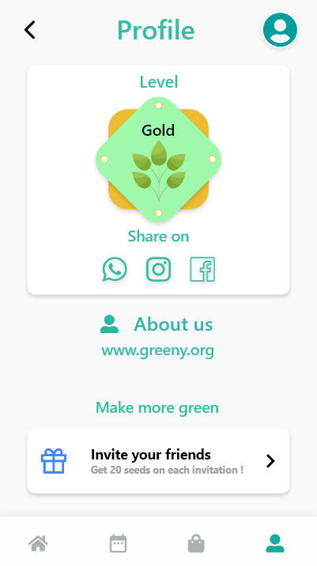

# Badge level

Badge for the giving level to user for some progress,Like some tier of user in application progress
### Show some :heart: and :star: the repo to support

## Screenshots

## Usage
https://github.com/DiksDev/badge-level/lib/badgelevel.dart

## Getting Started

For help getting started with Flutter, view our
[online documentation](https://flutter.dev/docs), which offers tutorials,
samples, guidance on mobile development, and a full API reference.
